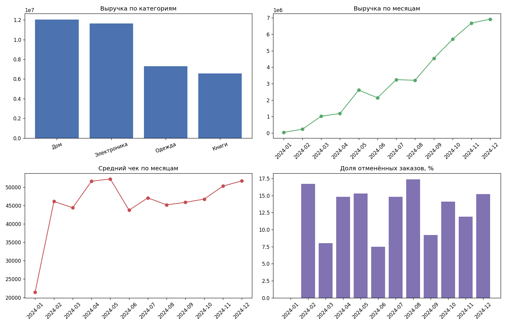

# SQL-аналитика интернет-магазина

Пет-проект: генерация базы данных, набор SQL-запросов от простых агрегаций до оконных функций и расчёт продуктовых метрик с визуализацией.



## Стек

Python 3, SQLite, pandas, matplotlib. Внешних баз и сервисов не требуется — всё работает локально.

## Структура

| Файл | Назначение |
|---|---|
| `create_db.py` | Создаёт `shop.db` и наполняет её синтетическими данными |
| `queries.sql` | 10 SQL-запросов: от агрегаций до оконных функций |
| `metrics.py` | Читает запросы, считает метрики, строит `dashboard.png` |

## Схема данных

```
customers    (customer_id, name, city, signup_date)
products     (product_id, name, category, price)
orders       (order_id, customer_id, order_date, status)
order_items  (item_id, order_id, product_id, quantity)
```

Объём: 500 клиентов, 16 товаров, ~900 заказов, ~2200 позиций за 2024 год. Генерация детерминированная (`random.seed(42)`), поэтому результаты воспроизводятся один в один.

## Запуск

```bash
pip install -r requirements.txt
python create_db.py
python metrics.py
```

Файл `shop.db` в репозиторий не коммитится — он создаётся заново одной командой.

## Что показывают запросы

| № | Запрос | Приём SQL |
|---|---|---|
| 1 | Общая статистика по базе | подзапросы в `SELECT` |
| 2 | Выручка по категориям | тройной `JOIN` + `GROUP BY` |
| 3 | Города со средним чеком выше порога | `HAVING` |
| 4 | Топ-10 клиентов по выручке | сортировка и `LIMIT` |
| 5 | Выручка по месяцам | группировка по дате через `strftime` |
| 6 | Средний чек по месяцам | `CTE` с промежуточной агрегацией |
| 7 | Рейтинг товаров внутри категории | `RANK() OVER (PARTITION BY ...)` |
| 8 | Накопительная выручка | оконная сумма нарастающим итогом |
| 9 | Retention | доля клиентов с двумя и более заказами |
| 10 | Доля отменённых заказов | условная агрегация через `CASE` |

## Метрики

- Общая выручка и её динамика по месяцам
- Средний чек и его изменение
- Retention: доля повторных покупателей
- Cancel rate: доля отменённых заказов
- Распределение выручки по категориям и городам

## Пример вывода

```
Выручка по категориям:
   category     revenue  units
        Дом 12050432.21    669
Электроника 11652065.17    842
     Одежда  7289379.31    635
      Книги  6551157.98    475

Retention:
 active_customers  repeat_customers  repeat_rate
              405               229         56.5
```
