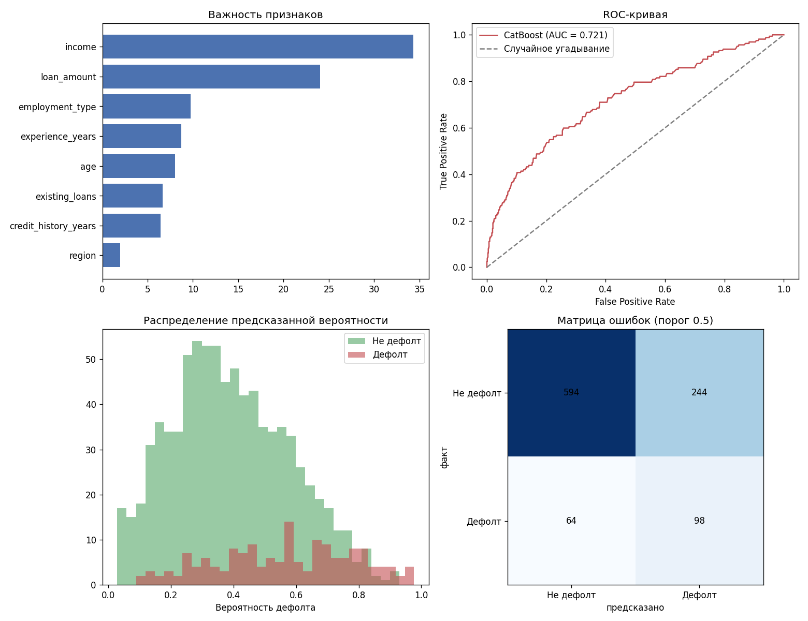

# Кредитный скоринг на CatBoost

Модель, предсказывающая вероятность дефолта по заявке на кредит. Обучение, сравнение с baseline, оценка качества и важность признаков.

## Задача

По анкетным данным заявителя предсказать вероятность, что он не вернёт кредит. Это задача бинарной классификации с несбалансированными классами: дефолтов в выборке заметно меньше, чем благополучных кредитов, — как и в реальном скоринге.

## Стек

Python 3, CatBoost, scikit-learn, pandas, matplotlib.



## Структура

| Файл | Назначение |
|---|---|
| `make_data.py` | Генерирует синтетический датасет заявок |
| `credit_applications.csv` | 4000 заявок: возраст, доход, стаж, кредитная история, тип занятости и другое |
| `train_model.py` | Обучает CatBoost, сравнивает с логистической регрессией, считает метрики |
| `evaluate.py` | Строит ROC-кривую, важность признаков, матрицу ошибок |

## Запуск

```bash
pip install -r requirements.txt
python train_model.py
python evaluate.py
```

## Почему CatBoost

Датасет содержит категориальные признаки: регион и тип занятости. У обычных линейных моделей их приходится вручную кодировать (one-hot, target encoding), и это отдельный источник ошибок и утечек данных. CatBoost работает с категориями напрямую — передаёшь список `cat_features`, дальше кодирование делает библиотека, аккуратно и без утечки информации из тестовой выборки в обучающую.

Второй момент — дисбаланс классов. Он решён через `class_weights`: модель штрафуется сильнее за ошибку на редком классе (дефолт), а не оптимизируется по перевешивающему большинству.

## Результаты

| Метрика | CatBoost | Логистическая регрессия |
|---|---|---|
| ROC-AUC | 0.721 | 0.717 |

На первый взгляд разница минимальна, и это ожидаемо: в синтетических данных связь между признаками и риском дефолта задана близко к линейной. CatBoost не проигрывает, но и не показывает драматического отрыва — потому что задача такого отрыва не предполагает.

Смысл сравнения не в том, чтобы найти победителя любой ценой, а в том, чтобы проверить, действительно ли сложная модель нужна. На реальных банковских данных связи обычно куда более нелинейные и полны взаимодействий между признаками (например, соотношение дохода и суммы кредита работает по-разному в зависимости от занятости) — там разрыв между CatBoost и линейной моделью, как правило, ощутимо больше.

**Метрики CatBoost при пороге 0.5:**

| Precision | Recall | F1 |
|---|---|---|
| 0.29 | 0.61 | 0.39 |

## Почему не accuracy

При доле дефолтов 16% модель, которая всегда предсказывает «нет дефолта», получит accuracy 84% и при этом не найдёт ни одного реального дефолта. Для скоринга это бесполезная модель, а метрика её не покажет как плохую.

Поэтому основная метрика — **ROC-AUC**: она не зависит от порога и от баланса классов, показывает общую способность модели ранжировать заявки от рискованных к безопасным.

**Recall 0.61** означает, что модель находит 61% реальных дефолтов. **Precision 0.29** — среди всех, кого модель считает рискованными, только 29% дефолтнут на самом деле. Это осознанный компромисс: в скоринге пропустить реальный дефолт обычно дороже, чем зря насторожиться по надёжному клиенту. Порог 0.5 можно сдвигать — понизить, чтобы поднять recall ценой ещё большего числа ложных срабатываний, или повысить, если ложные отказы надёжным клиентам обходятся дороже пропущенных дефолтов. Выбор порога — это бизнес-решение, а не техническое.

## Важность признаков

Наибольший вклад вносят доход и сумма кредита — это ожидаемо, поскольку соотношение платежа к доходу напрямую заложено в модель риска при генерации данных. Тип занятости и стаж идут следом. Регион почти не влияет — в данных он не был связан с риском специально.

## Возможные доработки

- Подбор порога классификации под конкретную бизнес-метрику (стоимость пропущенного дефолта против стоимости отказа надёжному клиенту)
- Калибровка вероятностей (Platt scaling / isotonic regression)
- Тюнинг гиперпараметров через `Optuna` или встроенный `catboost.grid_search`
- SHAP-анализ для объяснения предсказаний по отдельным заявкам, а не только общей важности признаков
