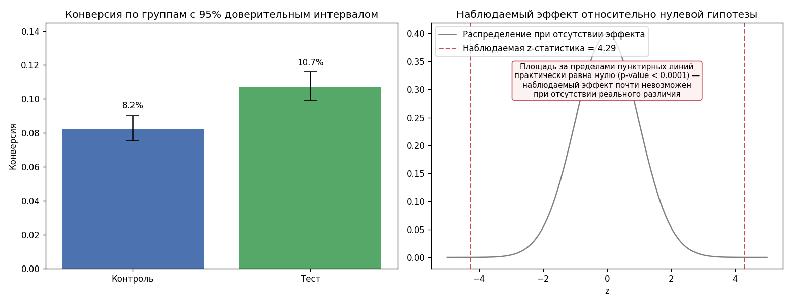

# Анализ A/B-теста: статистическая значимость

Проверка гипотезы, действительно ли новая версия продукта увеличивает конверсию, или наблюдаемая разница — случайность.

## Задача

Даны данные пользователей, разбитых на контрольную и тестовую группу, и факт конверсии по каждому. Нужно ответить на два вопроса: есть ли значимая разница между группами, и хватило ли данных, чтобы делать выводы вообще.

## Стек

Python 3, SciPy (`scipy.stats`), pandas, matplotlib.



## Структура

| Файл | Назначение |
|---|---|
| `make_data.py` | Генерирует данные теста: 5200 в контроле, 5150 в тесте |
| `ab_test_data.csv` | Пользователь, группа, факт конверсии |
| `analyze.py` | Z-тест для разности пропорций, доверительный интервал, ретроспективный расчёт нужного размера выборки |
| `visualize.py` | Конверсия по группам с доверительными интервалами и положение результата относительно нулевой гипотезы |

## Запуск

```bash
pip install -r requirements.txt
python make_data.py
python analyze.py
python visualize.py
```

## Результаты

| | Контроль | Тест |
|---|---|---|
| n | 5200 | 5150 |
| Конверсия | 8.25% | 10.72% |

Разница: **+2.47 п.п. (+29.9% относительно контроля)**
95% доверительный интервал разницы: **[1.34 п.п., 3.60 п.п.]**
p-value: **< 0.0001**

Результат статистически значим на уровне 0.05. Более того, весь доверительный интервал разницы лежит выше нуля — это значит, что эффект не просто «вероятно есть», а с высокой уверенностью положителен, а не просто «не равен нулю в какую-то сторону».

## Как устроен расчёт

**Z-тест для разности пропорций.** Проверяется гипотеза, что истинная конверсия в обеих группах одинакова. Для этого считается общая («pooled») конверсия по объединённой выборке, через неё — стандартная ошибка разности, и на её основе — z-статистика. Чем больше z по модулю, тем менее вероятно увидеть такую разницу, если бы группы на самом деле не отличались.

**p-value** — вероятность получить наблюдаемую или более выраженную разницу, если бы реального эффекта не было. Малое p-value не означает «эффект большой» — оно означает «такая разница маловероятна при отсутствии эффекта». За размер эффекта отвечает доверительный интервал, а не p-value, и в отчёте оба показаны рядом намеренно.

**Доверительный интервал** считается отдельно от теста значимости — через собственную стандартную ошибку разности (без объединения выборок). Это стандартная практика: тест значимости и интервальная оценка используют немного разные формулы стандартной ошибки.

**Проверка через chi-квадрат.** Для страховки тот же результат посчитан через тест независимости chi-квадрат на таблице сопряжённости 2×2. Он математически эквивалентен двустороннему z-тесту для пропорций (chi² ≈ z²), и p-value совпало: 1.8·10⁻⁵ у обоих методов.

**Ретроспективный размер выборки.** Отдельно рассчитано, сколько наблюдений понадобилось бы на группу, чтобы с мощностью 80% обнаружить эффект в 15% относительного прироста при базовой конверсии 8.2%. Получилось около 3880 на группу — фактически собрано больше, то есть теста было достаточно ещё до того, как он показал значимый результат.

## Важный нюанс: направление вывода

Если бы p-value оказалось больше 0.05, правильный вывод — «данных недостаточно, чтобы отличить эффект от случайности», а не «эффекта нет». Это разные утверждения: отсутствие доказательств не является доказательством отсутствия. Ретроспективный расчёт размера выборки — это как раз инструмент, чтобы не путать одно с другим: если выборка меньше требуемой, незначимый результат мог получиться просто из-за недостатка данных, а не из-за отсутствия эффекта.

## Возможные доработки

- Поправка на множественные сравнения (Bonferroni), если тестируется больше двух вариантов сразу
- Секвенциальный анализ для остановки теста раньше плановой длительности при явном эффекте
- Проверка на предвзятость выборки (SRM — sample ratio mismatch): убедиться, что пользователи действительно распределились по группам 50/50, а не с перекосом из-за бага в сплитовании
